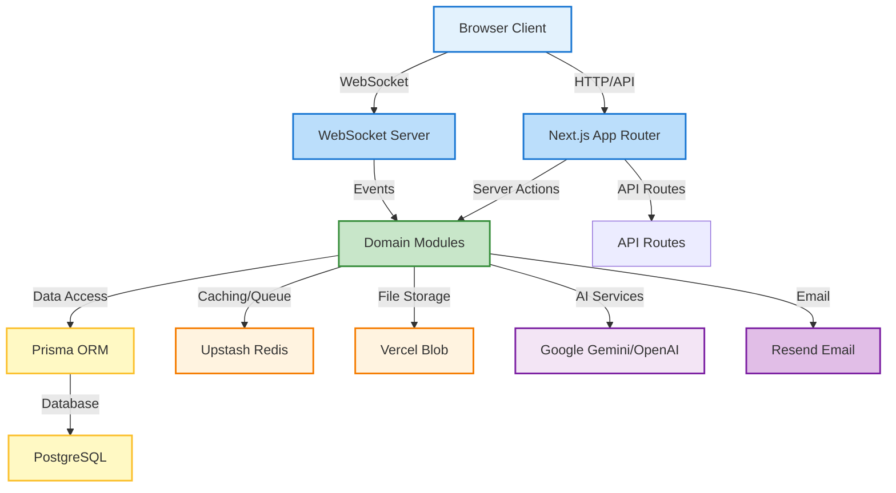

# Sastram Architecture Documentation

## Overview

Sastram is a modern AI-powered forum application built with Next.js, TypeScript, and PostgreSQL. It provides real-time communication through WebSockets, AI-driven moderation, and community management features.

## Project Purpose

Sastram aims to create a intelligent, scalable forum platform that combines traditional community features with modern AI capabilities to enhance user experience and content quality.

## Core Technology Stack

- **Frontend:** Next.js 16, React 19, TypeScript, Tailwind CSS
- **Backend:** Node.js, Next.js API routes, Prisma ORM
- **Database:** PostgreSQL
- **Real-time Communication:** WebSockets
- **Authentication:** Better Auth
- **Caching & Rate Limiting:** Upstash Redis
- **File Storage:** Vercel Blob Storage
- **AI Integration:** Google Gemini, OpenAI
- **Email:** Resend
- **UI Components:** shadcn/ui
- **State Management:** TanStack Query

## System Architecture



## Directory Structure

### Root Level Structure

```
├── app/                      # Next.js App Router pages and API routes
├── components/               # React UI components
├── lib/                      # Shared utilities and infrastructure
├── modules/                  # Domain logic
├── prisma/                   # Database schema and migrations
├── public/                   # Static assets
├── scripts/                  # Helper scripts
├── stores/                   # State management
├── test/                     # Test files
└── shared/                   # Shared documentation (ARCHITECTURE.md, context.md)
```

### App Directory (Next.js Routes)

```
app/
├── (public)/                 # Public routes (login)
├── (protected)/              # Protected routes with auth middleware
├── api/                      # API endpoints
└── layout.tsx                # Root layout
```

### Modules Directory (Domain Logic)

```
modules/
├── auth/                     # Authentication and session management
├── users/                    # User management
├── threads/                  # Forum thread management
├── messages/                 # Message handling
├── topics/                   # Topic/category management
├── moderation/               # Content moderation
├── reports/                  # Report handling
├── appeals/                  # Appeal process
├── newsletter/               # Newsletter subscription and digest
├── follows/                  # User following system
├── bookmarks/                # Bookmark management
├── tags/                     # Tagging system
├── activity/                 # User activity tracking
├── reputation/               # Reputation system
├── badges/                   # Badge system
├── polls/                    # Poll management
├── invitations/              # Thread invitations
└── search/                   # Search functionality
```

### Lib Directory (Infrastructure)

```
lib/
├── config/                   # Configuration (env variables, constants)
├── db/                       # Database utilities
├── http/                     # HTTP utilities (API responses)
├── infrastructure/           # WebSocket, logger, Prisma client
├── middleware/               # Request middleware
├── schemas/                  # Data schemas
├── security/                 # Security utilities (CSRF, validation)
├── services/                 # External services (AI, email, storage)
├── types/                    # Type definitions
├── utils/                    # General utilities
└── validation/               # Validation helpers
```

## Main Components & Their Interactions

### 1. Authentication System

**Purpose:** Handles user authentication and session management.

**Key Components:**
- `modules/auth/` - Auth session management
- `app/api/auth/` - Auth API endpoints
- `better-auth` library - Core authentication
- Middleware - Route protection

**Workflow:**
1. User logs in with email/password or social provider (GitHub/Google)
2. Session is created and stored in database
3. Session cookie is set for subsequent requests
4. Middleware validates session for protected routes

### 2. Thread Management

**Purpose:** Handles forum thread creation, retrieval, and management.

**Key Components:**
- `modules/threads/` - Thread actions and repository
- `app/(protected)/dashboard/` - Dashboard interface
- `app/(protected)/dashboard/threads/` - Thread listing and detail
- WebSocket server - Real-time thread updates

**Workflow:**
1. User creates a thread with title, description, tags
2. Thread is stored in database
3. WebSocket notifies all subscribers
4. Thread appears in dashboard and search results

### 3. Real-time Messaging

**Purpose:** Enables real-time communication within threads.

**Key Components:**
- `lib/infrastructure/websocket/` - WebSocket server and client
- `modules/messages/` - Message handling
- `components/thread/` - UI components

**Workflow:**
1. User sends a message in a thread
2. Message is stored in database via server action
3. WebSocket broadcasts message to all thread participants
4. UI updates in real-time

### 4. Content Moderation

**Purpose:** Maintains content quality and safety.

**Key Components:**
- `modules/moderation/` - Moderation logic
- `modules/reports/` - Report handling
- `modules/appeals/` - Appeal process
- AI services - Content analysis
- `app/(protected)/dashboard/admin/` - Admin interface

**Workflow:**
1. User reports a message
2. Message is added to moderation queue
3. Moderator reviews report
4. Action is taken (approve/delete/warn)
5. User can appeal decision

### 5. Newsletter System

**Purpose:** Provides email digests of thread activity.

**Key Components:**
- `modules/newsletter/` - Newsletter management
- `app/api/newsletter/` - Newsletter API endpoints
- AI services - Content summarization
- Resend - Email delivery

**Workflow:**
1. User subscribes to a thread's newsletter
2. Digest is scheduled (24h)
3. AI generates summary of thread activity
4. Email is sent to subscribers

### 6. Search System

**Purpose:** Enables search functionality for threads and content.

**Key Components:**
- `modules/search/` - Search logic
- `app/(protected)/dashboard/search/` - Search interface
- Database indexing - Efficient querying

**Workflow:**
1. User enters search query
2. Search module queries database
3. Results are returned and displayed

### 7. User Management

**Purpose:** Handles user profiles and settings.

**Key Components:**
- `modules/users/` - User actions and repository
- `app/(protected)/dashboard/settings/` - Settings interface
- `app/(protected)/user/` - User profiles

**Workflow:**
1. User updates profile information
2. Changes are stored in database
3. Profile is updated for all viewers

## Data Models

### Core Entities

- **User:** Represents a registered user with profile information
- **Thread:** Represents a forum thread with metadata and messages
- **Message:** Represents a message within a thread
- **Community:** Represents a community/group of threads
- **Report:** Represents a report on a message
- **Appeal:** Represents an appeal against a moderation decision
- **NewsletterSubscription:** Represents a user's newsletter subscription
- **ThreadDigest:** Represents a scheduled thread digest email

### Database Schema

The database schema is defined in `prisma/schema.prisma` and includes:

- User authentication tables (User, Session, Account)
- Content tables (Thread, Message, Attachment)
- Community tables (Community, Section)
- Moderation tables (Report, Appeal, UserBan)
- Newsletter tables (NewsletterSubscription, ThreadDigest)
- Activity tracking tables (UserActivity, AuditLog)
- Social features tables (UserFollow, UserBookmark, Reaction)

## API Architecture

### Route Structure

API routes are defined in `app/api/` and follow RESTful principles:

- `app/api/threads/` - Thread operations
- `app/api/conversations/` - Conversation operations
- `app/api/newsletter/` - Newsletter operations
- `app/api/v1/moderation/` - Moderation API
- `app/api/auth/` - Authentication endpoints

### Request/Response Format

All API responses follow a standard format with success/error indicators and data payloads.

### Rate Limiting

API endpoints are protected by rate limiting using Upstash Redis to prevent abuse.

## Security Considerations

- **Authentication:** Session-based authentication with secure cookies
- **Authorization:** Role-based access control (User, Moderator, Admin)
- **Input Validation:** Zod schemas for all API inputs
- **CSRF Protection:** CSRF tokens for server actions
- **XSS Prevention:** React automatic escaping and content sanitization
- **Rate Limiting:** Upstash Redis rate limiting
- **File Uploads:** Vercel Blob storage with strict validation

## Performance Optimization

- **Caching:** TanStack Query caching with 60s stale time
- **Image Optimization:** Next.js Image component with automatic resizing
- **Database Indexing:** Prisma schema includes appropriate indexes
- **WebSocket Efficiency:** Thread-scoped WebSocket connections
- **API Optimization:** Response compression and efficient queries

## Development & Deployment

### Development Setup

```bash
npm install
npm run dev
```

### Deployment

- **Vercel:** Production deployment with serverless functions
- **Database:** Neon PostgreSQL (serverless)
- **Redis:** Upstash Redis (serverless)
- **Storage:** Vercel Blob Storage

### CI/CD

- GitHub Actions for linting and testing
- Automatic deployment on push to main branch

## Monitoring & Analytics

- **Vercel Analytics:** Real-time analytics and performance monitoring
- **Error Tracking:** Custom error handling and logging
- **Audit Logs:** Detailed audit trail of user actions and moderation decisions

## Future Enhancements

- **AI-Powered Recommendations:** Personalized thread recommendations
- **Advanced Search:** Full-text search with ranking
- **Push Notifications:** Browser push notifications for new messages
- **Video/Audio Support:** Rich media messaging
- **Mobile App:** Native mobile applications
- **Integration APIs:** Third-party integration capabilities

## Conclusion

Sastram is a well-architected forum platform that combines traditional community features with modern AI capabilities. The modular design ensures scalability and maintainability, while the real-time communication and AI-driven moderation provide an exceptional user experience.
